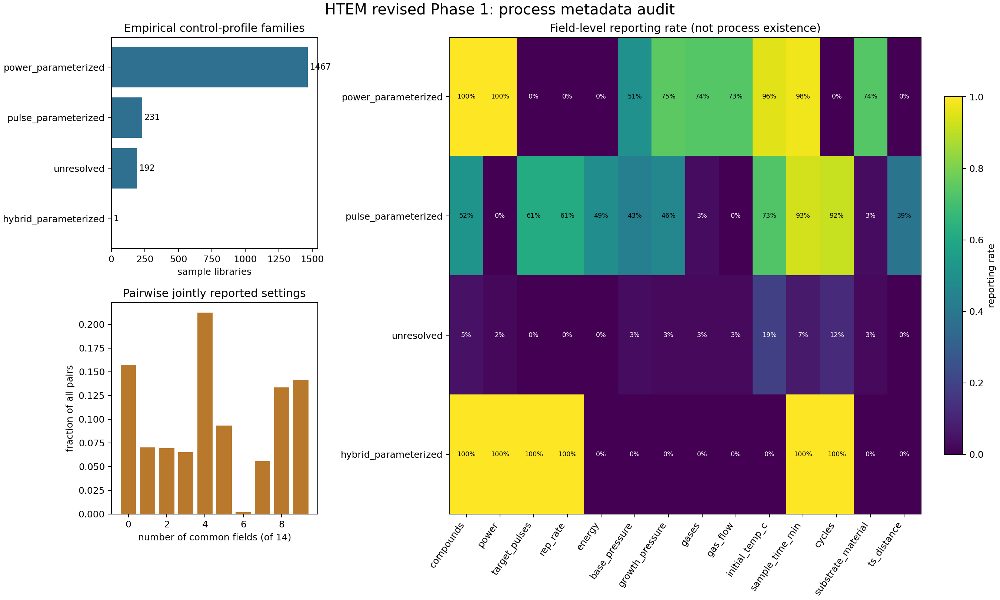

# 改訂 Phase 1：HTEM 工程記載監査

## 結論

HTEM全 **1,891 sample library** を再監査し、目的変数・専門家判断・欠損補完を一切用いないPhase 1を完了した。実質的な工程設定が1項目以上記載されたlibraryは **1,739 (92.0%)**、全14項目が未記載だったlibraryは **152 (8.0%)** だった。

最も重要な結果は、HTEMには工程設定値は豊富にある一方、**明示的な合成方法名、複数工程のイベント列、工程順序は収録されていない**ことである。`deposition_cycles` は 236 件にあるが、何を1 cycleとするかと各cycle内の工程列がないため、焼成→冷却→再焼成のような系列には復元できない。配列はターゲット／ガス等の並列スロットであり、時系列として扱わない。

よってPhase 2でHTEMから直接評価できるのは、主に**共通して記載された設定条件の類似度と、その未記載による区間幅**である。工程種類、順序・反復の重みを含む一般式は維持するが、HTEMに情報がないブロックを推定値で埋めない。工程系列の本格検証はNanoMine等の明示的工程記録を持つデータに移す。

## 1. 使用情報と隔離

- 使用：元素集合、14のdeposition設定項目、sample library ID。
- 監査専用：`deposition_instrument`。これは装置コードであり合成方法名ではないため、類似度へ入れない。
- 不使用：電気・光学物性、膜厚、XRDピーク数、測定温度、所有者、日付、研究ID。
- 欠損補完：なし。空欄、`null`、`[null,...]` は `NOT_REPORTED` とした。
- `0`：明示的な設定値として保持した。欠損とはしない。
- `NOT_PERFORMED`、`UNCONTROLLED`、`NOT_APPLICABLE`：HTEMの現行スキーマから明示判定できる記録は0件であり、空欄から推定していない。

## 2. 方法の代わりに識別できた記載プロファイル

方法名がないため、設定項目だけから「empirical control-profile family」を機械的に作った。これは方法分類ではなく、データ監査用の記載プロファイルである。

| 記載プロファイル | library数 | 割合 |
|---|---:|---:|
| `power_parameterized` | 1,467 | 77.6% |
| `pulse_parameterized` | 231 | 12.2% |
| `unresolved` | 192 | 10.2% |
| `hybrid_parameterized` | 1 | 0.1% |

`pulse_parameterized` 231件中、`deposition_cycles` も記載されたものは **212件**だった。一方、`power_parameterized` ではcycle記載は **0件**だった。これは興味深いデータ構造だが、方法名の代替ラベルではなく、次段階で検討する仮説である。

装置コードと記載プロファイルのCramér's Vは **0.557** だった。したがって記載パターンは装置・入力様式に強く依存し得る。装置IDや欠損マスクだけで得られるクラスターは材料類似度の発見とは扱わない。

## 3. 項目別の記載状況

| 設定項目 | 記載library | 記載率 | 一部nullを含む配列 |
|---|---:|---:|---:|
| `deposition_compounds` | 1,597 | 84.5% | 1,095 |
| `deposition_power` | 1,472 | 77.8% | 962 |
| `deposition_target_pulses` | 143 | 7.6% | 0 |
| `deposition_rep_rate` | 143 | 7.6% | 0 |
| `deposition_energy` | 113 | 6.0% | 0 |
| `deposition_base_pressure_mtorr` | 848 | 44.8% | 0 |
| `deposition_growth_pressure_mtorr` | 1,212 | 64.1% | 0 |
| `deposition_gases` | 1,094 | 57.9% | 979 |
| `deposition_gas_flow_sccm` | 1,083 | 57.3% | 968 |
| `deposition_initial_temp_c` | 1,607 | 85.0% | 0 |
| `deposition_sample_time_min` | 1,668 | 88.2% | 0 |
| `deposition_cycles` | 236 | 12.5% | 0 |
| `deposition_substrate_material` | 1,095 | 57.9% | 0 |
| `deposition_ts_distance` | 89 | 4.7% | 0 |

同一配列内の値とnullの混在は、値が記載されたスロットだけを利用し、nullスロットを非実施とも一致ともみなさない。工程テンプレートはプロファイル別の記載頻度を示すだけで、個別試料の実工程を補完しない。

## 4. ペアごとの共通記載量

全 **1,786,995** ペアについて、14項目中で両方に値が記載された項目数を集計した。

- 共通項目0：**280,950 (15.7%)**
- 中央値：**4項目**
- 10–90%点：**0–9項目**
- 最大：**9項目**

Phase 2では、共通記載項目だけから条件付き類似度を計算する一方、未記載部分の重みは再配分せず、支持下限・可能上限の幅へ入れる。共通項目0のペアは「工程が同じ」ではなく「工程類似度未解決」とする。

## 5. 工程テンプレートの固定結果

閾値は事前に `common >= 80%`、`optional = 20–80%`、`rare < 20%`、テンプレート作成の最小群サイズを **20件** と固定した。1件しかない `hybrid_parameterized` はテンプレートを確定せず `insufficient_sample_size` とした。テンプレートの `structural_not_applicable` は全て空である。実方法が不明なため、未記載を非該当へ変換する根拠がないからである。

生成物：

- `results/process_templates.json`：記載プロファイル別テンプレート
- `results/field_reporting_by_family.csv`：方法候補×設定項目の記載率
- `results/component_occurrence_by_family.csv`：工程facetの記載率
- `results/library_process_inventory.csv.gz`：library別状態・プロファイル

## 6. 工程系列の評価可能性

| 類似度成分 | HTEMでの状態 | Phase 2での扱い |
|---|---|---|
| 工程種類 | 単一のdeposition記録しかなく識別力がほぼない | 対照・被覆報告のみ |
| 工程順序 | 明示イベント列0件 | 欠損補完せず未解決 |
| 反復 | cycle数は一部あるが反復単位・内部順序不明 | 設定値としてのみ探索、系列とはしない |
| 工程内設定 | 複数項目に実データあり | 主な検討対象。共通記載項目だけで比較し区間化 |

## 7. 弱い支持情報の可用性

HTEM study表には **32 studies**、複数libraryを含むstudyは **21**、既知libraryとのリンクは **144 libraries** ある。同一studyはPhase 2の弱い正例としてのみ使用し、異なるstudyを負例とはしない。機関IDは現在のスナップショットにないため、同一機関検証はHTEMでは実施不能である。

## 8. Phase 1判定

判定は **`PROCEED_WITH_SCOPE_RESTRICTION`** とした。

これは「一般的な工程系列類似度をHTEMで検証できる」というGOではない。次を意味する。

1. 設定条件ブロックはHTEMでPhase 2解析を行える。
2. 未記載を補完せず、類似度区間とpairwise reporting coverageを必須とする。
3. 方法名、工程順序、反復系列についてHTEMから結論を出さない。
4. 装置・欠損パターン対照を必須とする。
5. NanoMineで方法・工程列を取得できた場合に、種類・順序・反復を包括検証する。

## 9. 改訂した最終判断基準

本研究は教師なし探索なので、全重み・全解像度で一つの結論に収束することを要求しない。Phase 2以降では、事前固定した解析格子の一部であっても、次を満たすクラスターまたは材料対が得られれば「興味深い探索結果あり」とする。

- 組成・工程のどの差がまとまりを作ったか機械的に記述できる。
- 行順変更または再標本化で再現する。
- reported/lower/upper境界のどこで維持・消失するか示せる。
- 同一study等の弱い支持情報がある、または未知の組合せとして明確な仮説を生む。
- 欠損マスクのみ・装置のみ・工程シャッフル対照だけでは同じ結果を説明できない。

「一部でよい」は事後的に都合のよい一例を選ぶ意味ではない。全プロファイルを開示し、興味深い結果が存在した領域と存在しなかった領域を併記する。

