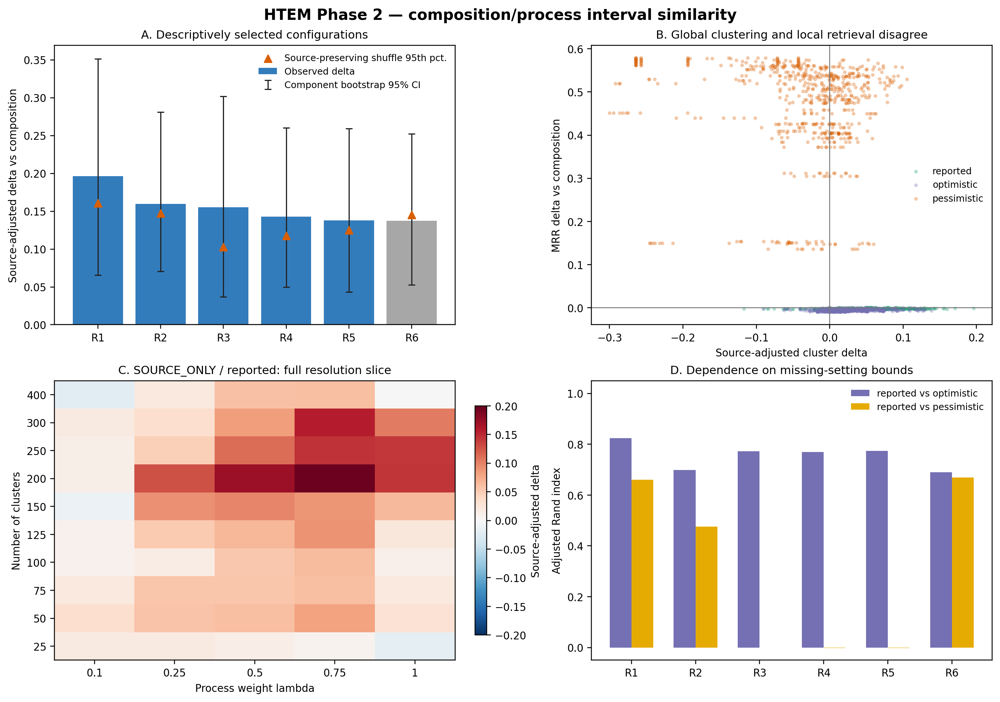
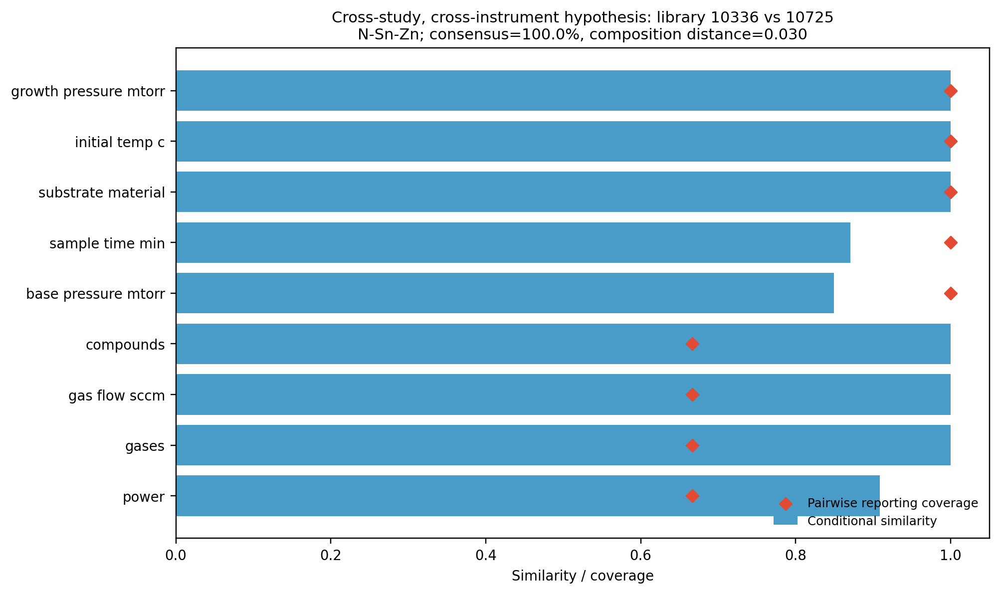

# HTEM材料類似度 Phase 2 実施報告

## 結論

Phase 2 は完了した。目的変数を使わず、HTEM薄膜ライブラリ **1,891件**について、組成類似度と成膜設定類似度を組み合わせ、事前に定めた **13重みプロファイル × 3欠損シナリオ × 5非ゼロ工程重み × 10クラスタ解像度 = 1,950件**と、組成のみ10件を解析した。

最終判断は、**「興味深いが限定的な文脈依存パターンが得られた」**である。原料・投入エネルギー、雰囲気、温度・時間を重視した複数の距離は、同じ研究に属するライブラリの大域的クラスタ共所属を組成のみより改善した。この改善は成膜装置と組成距離をそろえた比較、欠損マスク対照、工程値シャッフル対照を入れても5つの記述的候補で残った。一方、局所的な同一研究ライブラリ検索は改善しなかった。したがって、現時点で「単一の最良類似度」を選ぶ根拠はなく、**用途別・多視点の類似度**として扱うべきである。



## 1. 解析対象と固定した判断

- HTEMは共通の薄膜成膜スキーマとして扱い、合成方法名、工程順序、繰り返し系列は今回の距離に含めなかった。
- 目的変数、物性、構造・形態の測定結果、膜厚、XRD、電気・光学特性は入力から除外した。
- 組成は元素集合に加え、XRFの定量組成がある **1,252件**では組成分率、周期表上の族・周期、ライブラリ内組成幅を用いた。
- 工程は14設定を4側面に分けた：原料・投入エネルギー、雰囲気、温度・時間、基板・幾何。
- 欠損値は補完しなかった。「0」は設定値として保持し、未設定・未記載と区別した。
- 同一研究の別ライブラリを弱い正例とした。異なる研究の組は負例ではなく、未ラベル比較対象とした。専門家判断は用いていない。
- 重みとクラスタ数は最適化せず、全グリッドを開示した。上位6条件は探索後の記述的要約であり、事前選択された最適条件ではない。

## 2. 類似度と欠損の扱い

組成距離を \(C_{ij}\)、工程距離を \(P_{ij}\)、工程重みを \(\lambda\) とし、材料距離を

\[
D_{ij} = C_{ij} + (1-C_{ij})\lambda P_{ij}
\]

とした。これにより組成が遠い材料を、工程が似ているだけで過度に近づけない。

各工程変数 \(v\) について、2試料で共通に記載された設定だけから条件付き類似度 \(s_{v,ij}\) を計算し、比較可能な設定スロット割合を \(q_{v,ij}\) とした。重み \(w_v\) に対して、記載から支持される類似度は

\[
S^{\mathrm{supported}}_{ij}
=\sum_v w_v q_{v,ij}s_{v,ij},\qquad
Q_{ij}=\sum_v w_vq_{v,ij}
\]

である。補完の代わりに次の3通りを全て計算した。

| シナリオ | 工程類似度 | 意味 |
|---|---:|---|
| optimistic | \(S^{\mathrm{supported}}+(1-Q)\) | 未記載部分が全て一致する上端 |
| reported | \(S^{\mathrm{supported}}/Q\)（\(Q=0\)なら工程寄与なし） | 共通記載部分に条件付けた主解析 |
| pessimistic | \(S^{\mathrm{supported}}\) | 未記載部分が全て不一致の下端 |

同時欠損は一致として数えていない。数値配列は双方に存在するスロット数まで比較し、残りは \(Q\) の低下として不確実性幅に入れた。カテゴリ配列は正規化後の集合Jaccard類似度を使った。

等重み（EQ）で全ペアの比較可能工程割合は平均 **0.269**、中央値 **0.233**であり、弱い正例では平均 **0.452**、中央値 **0.567**だった。弱い正例 1,069件のうち **215件**は、EQで共通記載工程がゼロだった。欠損境界への感度は周辺事項ではなく主要結果である。

## 3. 評価設計と交絡補正

弱い正例は 21研究、17独立研究成分、1,069ペアインスタンス（857一意ペア）。未ラベル比較は 250,000ペアである。同一研究ペアのクラスタ共所属率から、組成距離が近い未ラベルペアの期待共所属率を差し引き、研究成分を等重みで平均した。

初期監査で、弱い正例の **1,058/1,069件**が同じ成膜装置だった。このため、最終評価では未ラベル側も「組成距離ビン＋同じ装置／装置対」で完全一致させた。装置IDは距離の特徴には使わず、評価時の交絡調整だけに使った。装置だけでクラスタリングした未補正の成分等重み超過は **0.460**だったが、装置照合後は **0.000**となり、この対照が意図通り働いた。

さらに、工程ベクトルを（a）元素系内、（b）元素系＋成膜装置内で50回シャッフルし、行順を3通り変えて安定性を検証した。装置補正は初回ドライラン後に必要性が判明して追加したため、以下は確認的検定ではなく探索的解析である。

## 4. 全グリッドの傾向

工程を含む 1,950クラスタリングのうち、装置補正後の成分等重み指標が組成のみを上回ったのは **1,341件（68.8%）**、欠損マスク対照を上回ったのは **1,133件（58.1%）**、両方を上回ったのは **1,040件（53.3%）**だった。局所検索MRRが組成のみを上回ったのは **690件（35.4%）**にとどまった。

| 欠損シナリオ | 装置補正delta中央値 | 最大値 | 組成・マスク対照の両方を上回る | MRR delta範囲 |
|---|---:|---:|---:|---:|
| reported | 0.038 | 0.196 | 493/650 | -0.0052 ～ 0.0008 |
| optimistic | 0.018 | 0.139 | 370/650 | -0.0096 ～ 0.0002 |
| pessimistic | -0.015 | 0.105 | 177/650 | 0.1358 ～ 0.5785 |

`pessimistic`でMRRだけが大きくなるのは、物理的な近さよりも欠損・記載パターンによる近傍を作るためと解釈するのが妥当である。したがって主解析は`reported`、optimistic/pessimisticは不確実性境界とした。

`reported`主解析を重みプロファイル別に集約すると次のようになった。各行の「最大条件」は選択結果の説明用であり、最適化結果ではない。

|工程内の固定重みプロファイル|装置補正delta中央値|最大値|最大時のlambda / クラスタ数|組成・マスク対照の両方を上回る|最大MRR delta|
|---|---:|---:|---:|---:|---:|
| `ATMOS55` | 0.041 | 0.155 | 1 / 150 | 37/50 | -0.0019 |
| `ATMOS_ONLY` | 0.047 | 0.160 | 0.75 / 50 | 38/50 | -0.0033 |
| `ATMOS_THERM` | 0.034 | 0.143 | 1 / 50 | 35/50 | -0.0020 |
| `EQ` | 0.044 | 0.133 | 0.5 / 50 | 43/50 | -0.0020 |
| `SOURCE55` | 0.060 | 0.129 | 0.5 / 50 | 43/50 | -0.0019 |
| `SOURCE_ATMOS` | 0.050 | 0.134 | 0.5 / 200 | 42/50 | -0.0019 |
| `SOURCE_ONLY` | 0.055 | 0.196 | 0.75 / 200 | 43/50 | -0.0013 |
| `SOURCE_THERM` | 0.047 | 0.130 | 0.5 / 50 | 41/50 | -0.0020 |
| `SUBSTR55` | 0.026 | 0.078 | 1 / 300 | 30/50 | -0.0021 |
| `SUBSTR_ONLY` | 0.012 | 0.060 | 0.1 / 50 | 24/50 | -0.0023 |
| `THERM55` | 0.038 | 0.138 | 1 / 50 | 41/50 | -0.0020 |
| `THERM_ONLY` | 0.046 | 0.129 | 0.5 / 50 | 39/50 | 0.0008 |
| `THERM_SUBSTR` | 0.031 | 0.137 | 0.5 / 50 | 37/50 | -0.0021 |

基板・幾何だけを重くした条件は相対的に弱く、原料・投入エネルギー、雰囲気、温度・時間を含む条件でより一貫した正の傾向が見られた。ただし、フィールドの記載率と研究デザインも異なるため、これを物理的重要度の順位とは解釈しない。

工程全体の重み \(\lambda\) 別では、主解析の中央値は重みとともに増えたが、最大値は0.75で現れた。

|lambda|装置補正delta中央値|最大値|組成・マスク対照の両方を上回る|
|---:|---:|---:|---:|
| 0.1 | 0.009 | 0.069 | 93/130 |
| 0.25 | 0.020 | 0.128 | 81/130 |
| 0.5 | 0.050 | 0.171 | 99/130 |
| 0.75 | 0.062 | 0.196 | 112/130 |
| 1 | 0.069 | 0.155 | 108/130 |

したがって、今回の範囲では工程情報を極端に小さくするより中～高程度に効かせる方が大域クラスタに寄与したが、唯一の推奨値は定めない。

## 5. 記述的上位条件と頑健性

|順位|条件|クラスタ数|装置補正delta<br>vs組成|装置補正delta<br>vs欠損マスク|成分bootstrap 95%区間|装置維持shuffle 95%点|選択後p値|行順ARI|optimistic / pessimistic ARI|MRR delta|判断|
|---:|---|---:|---:|---:|---:|---:|---:|---:|---:|---:|---|
| 1 | `SOURCE_ONLY__reported__L075` | 200 | 0.196 | 0.133 | [0.066, 0.352] | 0.161 | 0.0196 | 0.900 | 0.824 / 0.660 | -0.0013 | 支持診断を通過 |
| 2 | `ATMOS_ONLY__reported__L075` | 50 | 0.160 | 0.134 | [0.071, 0.281] | 0.147 | 0.0196 | 0.759 | 0.699 / 0.476 | -0.0033 | 支持診断を通過 |
| 3 | `ATMOS55__reported__L100` | 150 | 0.155 | 0.130 | [0.037, 0.302] | 0.103 | 0.0196 | 0.897 | 0.773 / -0.000 | -0.0019 | 支持診断を通過 |
| 4 | `ATMOS_THERM__reported__L100` | 50 | 0.143 | 0.149 | [0.050, 0.260] | 0.117 | 0.0196 | 0.776 | 0.770 / -0.003 | -0.0020 | 支持診断を通過 |
| 5 | `THERM55__reported__L100` | 50 | 0.138 | 0.144 | [0.043, 0.259] | 0.125 | 0.0196 | 0.719 | 0.773 / -0.002 | -0.0020 | 支持診断を通過 |
| 6 | `THERM_SUBSTR__reported__L050` | 50 | 0.137 | 0.135 | [0.053, 0.252] | 0.145 | 0.1765 | 0.918 | 0.690 / 0.669 | -0.0026 | シャッフル対照を通過せず |

順位1～5は、定めた文脈支持診断を通過した。順位6は観測値がシャッフル95%点を超えず、支持候補から除外した。ここでのp値は50回シャッフルに対する各選択条件の参考値であり、**全1,960結果からの事後選択や多重性を補正していない**。有意差の主張には使えない。

研究成分bootstrapでは上位5件の平均deltaは **0.138～0.196**、95%区間の下端は **0.037～0.071**で正だったが、最大成分の絶対寄与割合は概ね0.28～0.34だった。効果は単一研究だけではない一方、研究系横断で一様でもない。

定量XRF組成を持つ1,252件だけで再解析すると、上位6件の装置補正delta平均は **0.163～0.257**で、全てのbootstrap区間下端が正だった。元素集合だけの粗い組成表現が結果を単独で作ったとは考えにくい。

## 6. 大域クラスタリングと局所検索は別の挙動

組成のみの同一研究検索は、138アンカーで MRR **0.0428**、Hit@10 **0.0797**、Recall@10 **0.0319**だった。記述的上位6条件のMRR差は全て負（約−0.0013～−0.0033）だった。一方、欠損マスクだけでは MRR **0.0652**だった。

これは矛盾ではない。同一研究では同じ材料系・装置の中で工程条件を意図的に走査するため、研究全体は大域的にまとまっても、最も近い個別試料は工程値が異なり得る。したがって、

- 文献群・実験キャンペーンをまとめる類似度
- 最近傍材料を検索する類似度
- 改変効果を転移する類似度

は同じ重みである必要がない。今回の結果は「クラスタリング用途では工程を加える価値がある」が、「局所検索にも同じ距離を転用できる」とは示していない。

## 7. 興味深いクラスタ仮説

全195の工程込み距離をクラスタ数150で比較し、異なる研究・異なる成膜装置でも80%以上同じクラスタとなるペアを抽出した。20ペアが基準を満たした。最上位はライブラリ **10336**（装置5）と **10725**（装置1）で、どちらも **N-Sn-Zn**、組成距離 **0.030**、EQの条件付き工程距離 **0.041**、比較可能割合 **0.567**、全条件共クラスタ率 **100.0%**だった。

選択条件の該当クラスタは87件で、N-Sn-Znが82件、装置1が59件、装置5が28件を含む。これは装置IDを特徴に使わずに現れた、装置横断の再現候補である。

|共通工程設定|条件付き類似度|ペア比較可能割合|
|---|---:|---:|
| `growth_pressure_mtorr` | 1.000 | 1.000 |
| `initial_temp_c` | 1.000 | 1.000 |
| `substrate_material` | 1.000 | 1.000 |
| `sample_time_min` | 0.871 | 1.000 |
| `base_pressure_mtorr` | 0.849 | 1.000 |
| `compounds` | 1.000 | 0.667 |
| `gas_flow_sccm` | 1.000 | 0.667 |
| `gases` | 1.000 | 0.667 |
| `power` | 0.909 | 0.667 |



このペア群は「同じ物理材料」と検証された正解ではなく、次段階で構造・物性・原論文記載を確認する候補である。

## 8. 到達した判断と限界

今回の教師なしPhase 2の判断基準――一部でも、対照を越えて解釈可能かつ再現的なクラスタ／材料ペアパターンが得られること――は満たした。ただし結論は次に限定する。

1. HTEMでは組成だけでなく工程設定を含む類似度が、大域クラスタリングの弱い文脈整合性を改善し得る。
2. とくに原料・投入エネルギー、雰囲気、温度・時間に信号がある。ただしこれは因果的重要度や普遍的な最適重みを意味しない。
3. 欠損境界でクラスタが大きく変わる条件がある。1個の点推定類似度ではなく、`reported`とoptimistic/pessimisticを併記すべきである。
4. 同一研究は独立した真値ラベルではなく、研究テーマ、装置、記載様式を共有する弱い代理情報である。装置交絡は補正したが、研究機関や未収録のバッチ情報は残り得る。
5. 事後選択、多重比較、弱い正例17成分という制約があるため、確認的な統計的有意性は主張しない。
6. 「最良距離」は選ばない。全グリッドの傾向と、用途別に残った候補群をPhase 3へ渡す。
7. 複数ターゲット、電力、パルス等の配列は、装置スロット順に依存しない別々の集合／ソート済み数値列として比較した。そのため「どのターゲットにどの電力を与えたか」というスロット間対応は表現していない。これは合成工程順序とは別の課題であり、対応関係が信頼できるHTEMレコードが得られる場合の追加感度解析対象である。

## 9. Phase 3へ渡す具体案

- 主候補として `SOURCE_ONLY__reported__L075`、`ATMOS_ONLY__reported__L075`、`ATMOS55__reported__L100` を保持する。
- 比較基準として組成のみ、EQ、欠損マスクのみを必ず保持する。
- NanoMineの包括検証では、材料インスタンスを組成、ポリマー／フィラー、加工条件、測定条件に分け、HTEMと共通する「補完なし・ペアごとの共通記載・区間境界」を維持する。
- NanoMineに工程系列がある場合は、HTEMでは省略した工程種類・順序・繰り返し距離を独立成分として追加する。
- クラスタ整合性と近傍検索を別々に評価し、同一重みを前提にしない。
- HTEM側では、ターゲット化学種とターゲット別電力・パルスの対応を保持した順序不変マッチングを追加し、`SOURCE_ONLY`結果の感度を確認する。
- N-Sn-Zn装置横断クラスタなどの候補は、目的変数を導入しない範囲では原レコード整合性と別データセット再現性で検証する。

## 10. 再現手順と成果物

リポジトリ直下で以下を実行する。

```bash
python src/prepare_phase2_input.py --input ../htem_download --output-root .
python src/run_phase2.py --config config/phase2_run_config.json
python src/run_posthoc_sensitivity.py --config config/phase2_run_config.json
python src/make_phase2_figures.py
python src/make_phase2_report.py
python -m unittest discover -s tests -v
```

主要成果物は次の通り。

- `results/phase2_results.json`: 主要集計、診断、判断
- `results/phase2_grid.csv`: 全1,960クラスタリング結果
- `results/phase2_posthoc_sensitivity.json`: 成分bootstrap、定量組成限定、検索対照
- `results/interesting_pairs.json`: 同一研究および研究・装置横断の候補ペア
- `results/selected_assignments.jsonl.gz`: 記述的上位条件の全割当
- `results/selected_cluster_profiles.json`: 上位条件のクラスタ要約
- `config/phase2_spec.json`: 解析仕様、欠損方針、監査履歴

---

解析ステータス: `INTERESTING_SOURCE_ADJUSTED_CONTEXT_PATTERNS_FOUND`  
乱数seed: `20260909`  
主要解析実行時間: 170.9秒
