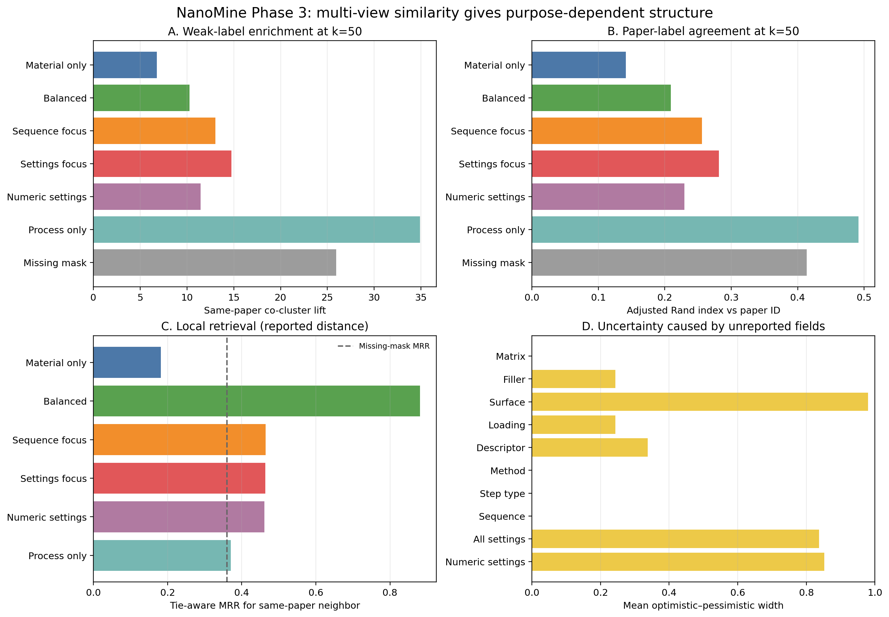
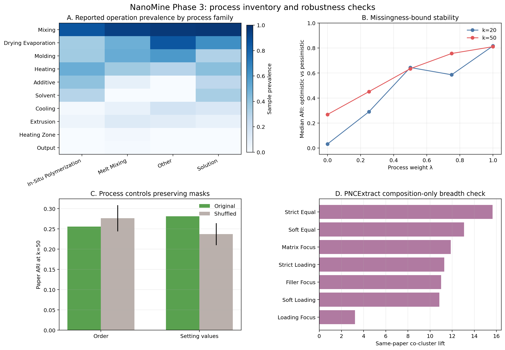

# NanoMine材料類似度 Phase 3 実施報告

作成日: 2026-09-10  
解析種別: 目的変数を使わない教師なしクラスタリング  
結論方針: 単一の「最良類似度」は選ばず、用途別の複数ビューを維持する

## 1. 結論

Phase 3を実行した。主解析はNanoMine/MaterialsMineの **832試料・119論文**、補助的な組成幅広さ解析はNanoMine由来PNCExtractの **1,103試料・217論文**である。物性値・目的変数・顕微鏡像は一切使用していない。

得られた主要結論は次のとおりである。

1. **材料構成と工程を合わせると、同一論文内の近傍検索が大きく改善した。** 報告値距離のtie-aware MRRは、材料のみ 0.182、工程のみ 0.370、均衡ビュー 0.881 であった。したがって、二者は代替ではなく相補的である。
2. **工程中心のクラスタは同一論文を強く再現するが、欠損・記載様式も強く再現している。** k=50の論文ARIは工程のみ 0.492 に対し、欠損マスクのみでも 0.414 であった。工程類似度の成功を、そのまま物理的類似性の証明と解釈してはいけない。
3. **工程設定値には欠損マスクを超える情報が少量ながら見られた。** k=50で設定値を層内シャッフルすると、論文ARIは 0.281 から平均 0.237 へ低下した。一方、工程順序シャッフルではARIが低下せず、順序重視を支持する独立証拠は今回の弱いラベルからは得られなかった。
4. **欠損の影響はファセットごとに大きく異なる。** 表面処理の平均区間幅は 0.980、全工程設定値は 0.837 であり、単一値での順位付けは危険である。合成方法、工程種類、順序・反復は今回の抽出集合では系列が存在するため区間幅0であった。
5. **「興味深い結果」は得られた。** 異なる2論文 L157 と L238 のアルミナ/DGEBAエポキシ試料は、18個のセンチネル距離のうち 16 個で相互近傍候補となった。著者と所属Locationも一致し、工程はほぼ同一で、L238側にsolvent工程が1段追加されていた。専門家ラベルなしでも、関連研究系列を回収できた具体例である。
6. **組成のみの幅広さ解析でも傾向は再現したが、評価軸によって順位が変わった。** PNCExtractでk=50の同一論文liftはstrict_equal 15.65、loading_focus 3.23。一方、近傍MRRはstrict_equal 0.276、soft_loading 0.595 であり、クラスタ分割と局所検索で望ましい類似度が異なった。

## 2. データ取得と解析母集団

### 2.1 主解析

[MaterialsMine](https://materialsmine.org/) の公開サンプル索引には取得時点で1,610件があった。ライブSPARQLは知識グラフ移行中にHTTP 503を返したため、ウェブサイト自身が利用する公開検索キャッシュから、次の既存レスポンスを取得した。

- 材料構成ビュー: 907ユニーク試料
- 工程ビュー: 832ユニーク試料
- DOI・試料ラベル・合成方法ビュー: 836ユニーク試料
- 3ビューの積集合: **832試料**

同一試料に複数のキャッシュ文書があったが、内容衝突は0件であった。主解析は「公開キャッシュに工程ビューが存在した試料」の全件であり、NanoMine全1,610件の無作為標本ではない。この選択バイアスを明記する。

論文・著者・Locationの補助メタデータには、[PNCExtract](https://github.com/ghazalkhalighinejad/PNCExtract) の公開データを用いた。解析対象832件のうち794件で補助メタデータが得られた。ソース固定コミットはMaterialsMine `5a48d01d21b112aa36c62be22e470cc00620ef74`、PNCExtract `46a8175f1371048ae3d381bbc6e01e5922321794` である。

NanoMineがポリマーナノコンポジットのprocessing–structure–property情報をXMLスキーマと知識グラフで統合する設計であることは、[NanoMine schema論文](https://doi.org/10.1063/1.5046839) および [knowledge graph論文](https://doi.org/10.1007/978-3-030-62466-8_10) と整合する。本解析はそのうち材料構成とprocessingだけを使った。

### 2.2 合成方法別の工程棚卸し

まず合成方法で層別し、各層で10%以上の試料に記載された工程を棚卸しした。これは欠損補完には使わず、工程語彙とデータ完全性の把握にだけ使用した。

| 合成方法 | 試料数 | 10%以上に記載された工程（記載率） |
|---|---|---|
| In-Situ Polymerization | 120 | mixing (86%), heating (50%), additive (41%), molding (37%), drying evaporation (36%), solvent (30%) |
| Melt Mixing | 228 | mixing (93%), molding (51%), drying evaporation (50%), heating (37%), extrusion (13%) |
| Other Processing | 27 | mixing (96%), drying evaporation (85%), molding (59%), heating (30%), cooling (19%), extrusion (11%) |
| Solution Processing | 459 | mixing (97%), drying evaporation (63%), heating (42%), solvent (34%), molding (32%), additive (28%), cooling (15%) |

工程系列は、単なる集合ではなく、工程インデックス順の列として保持した。同一工程の繰返しも列中に複数回残した。

### 2.3 PNCExtract幅広さ集合

PNCExtractの手動整理済みsample_dataから1,103試料・217論文を得た。変数はmatrix名、filler名、各略称、filler mass fraction、volume fractionである。工程は含まれないため、組成類似度の補助検証専用とした。充填量は、mass/volumeの片方のみ記載1,016件、両方9件、両方なし78件であり、補完には適さない構成だった。

## 3. 類似度の定義

### 3.1 材料構成ファセット

- matrix identity: 正規化完全一致Jaccard、および文字3-gramによるsoft matching
- filler identity: 同上
- surface treatment identity: 同上
- loading: filler mass fraction、volume fraction
- component descriptor: density、width、aspect ratio、specific surface area

化学名のsoft matchingは表記差を緩和するだけで、化学構造・官能基・機構の同値性を推定するものではない。

### 3.2 工程ファセット

- 合成方法: Solution Processing、Melt Mixing、In-Situ Polymerization、Other Processing
- 工程種類: 記載工程タイプ集合のJaccard距離
- 順序・反復: 工程タイプ列の正規化編集距離。置換コストには工程ラベル集合のJaccard距離を使った
- 工程内設定: `工程タイプ#同種工程の出現番号:設定名` で対応付けた設定値距離

温度、時間、圧力、回転速度、長さは単位変換し、その他の数値は同一設定キー内のrobust rangeで尺度化した。カテゴリ設定は正規化文字3-gram距離とした。自由記述Descriptionは論文文体の漏洩を避けるため主解析から除いた。

材料距離と工程距離は、

$$
d_{\mathrm{total}}=(1-\lambda)d_{\mathrm{material}}+\lambda d_{\mathrm{process}},
\qquad 0\leq\lambda\leq1
$$

で統合した。実際の $\lambda$ は0、0.25、0.5、0.75、1とした。材料4プロファイル、工程6プロファイルを固定し、重み最適化は行っていない。

## 4. 欠損値の扱い

欠損値は一切補完していない。2試料で比較可能な変数集合を $C$、片側だけ記載された集合を $U$ とすると、

$$
d_L=\frac{\sum_{v\in C}d_v}{|C\cup U|},\quad
d_R=\frac{\sum_{v\in C}d_v}{|C|},\quad
d_U=\frac{\sum_{v\in C}d_v+|U|}{|C\cup U|}
$$

とした。$d_L$ はoptimistic、$d_R$ はreported、$d_U$ はpessimisticである。両試料とも未記載の変数は比較から外す。共通変数がないファセットのreported値は未定義とし、他ファセットの重みを再正規化した。

- 工程ブロック自体がない試料は主解析から除外済み
- 記載された工程列に工程がない場合は「記載系列にない」という観測差に使用
- ある工程内の設定値がない場合は、未設定か未記載か識別できないため距離区間を広げる
- fillerやsurface roleが取得ビューに現れない場合、存在しないと断定せず未記載扱い

ファセット別の比較可能性は次のとおりである。

| ファセット | reported可能ペア率 | 平均共通被覆 | 平均区間幅 | reported距離中央値 |
|---|---|---|---|---|
| マトリックス | 1.000 | 1.000 | 0.000 | 1.000 |
| フィラー | 0.757 | 0.757 | 0.243 | 1.000 |
| 表面処理 | 0.020 | 0.020 | 0.980 | 1.000 |
| 充填量 | 0.757 | 0.757 | 0.243 | 0.033 |
| 構成材記述子 | 1.000 | 0.662 | 0.338 | 0.184 |
| 合成方法 | 1.000 | 1.000 | 0.000 | 1.000 |
| 工程種類 | 1.000 | 1.000 | 0.000 | 0.667 |
| 順序・反復 | 1.000 | 1.000 | 0.000 | 0.727 |
| 全設定値 | 0.811 | 0.163 | 0.837 | 0.560 |
| 数値設定値 | 0.675 | 0.147 | 0.853 | 0.380 |

表面処理と工程設定は情報不足の影響が非常に大きい。これらを高重みにする場合、reportedだけでなく上下界を必ず併記すべきである。

## 5. クラスタリングと検証

- アルゴリズム: precomputed distanceに対するaverage-linkage階層クラスタリング
- グローバルcluster数: 8、12、20、30、50、80
- 合成方法内cluster数: 4、8、12、20
- 主グリッド: 360距離ビュー × 6 cluster数 = **2,160クラスタリング**
- 合成方法別: **288クラスタリング**
- PNCExtract幅広さ解析: **126クラスタリング**

検証情報は距離作成には用いず、クラスタ結果の後から評価した。

- 主弱ラベル: 同一NanoMine文献ID（L/E接頭辞）の別試料、4,985ペア
- 補助情報: 異なる論文で著者が1名以上一致、8,437ペア
- 補助情報: 異なる論文でLocation文字列が完全一致、92ペア
- 異なる論文ペアは負例ではなく、比較背景集合

liftはcluster数が多いほど背景併合率が下がって機械的に大きくなるため、異なるk間で「最良」を決める目的には使っていない。

## 6. 主解析結果

### 6.1 センチネル6ビュー

k=50、reported距離の結果を示す。

| ビュー | 同一論文併合率 | 異論文併合率 | 同一論文lift | 論文ARI | 共著者lift | 近傍MRR | 平均区間幅 |
|---|---|---|---|---|---|---|---|
| 材料のみ | 0.857 | 0.126 | 6.79 | 0.141 | 2.02 | 0.182 | 0.207 |
| 均衡 | 0.931 | 0.091 | 10.28 | 0.209 | 2.71 | 0.881 | 0.225 |
| 順序重視 | 0.957 | 0.073 | 13.02 | 0.256 | 3.03 | 0.465 | 0.166 |
| 設定値重視 | 0.947 | 0.064 | 14.73 | 0.281 | 3.16 | 0.463 | 0.334 |
| 数値設定重視 | 0.938 | 0.082 | 11.45 | 0.230 | 2.80 | 0.461 | 0.338 |
| 工程のみ | 0.980 | 0.028 | 34.91 | 0.492 | 3.64 | 0.370 | 0.209 |

全センチネルで論文ラベル200回置換に対する片側p値は最小解像度の $1/(200+1)=0.00498$ であった。ただし、これは「同じ論文の試料が偶然以上にまとまる」ことだけを示し、材料物理の真のクラスを示さない。

均衡ビューの近傍MRR 0.881 は、材料のみ・工程のみのいずれよりも高い。材料構成と工程の一致を同時に要求すると、同一研究系列が近傍の先頭へ移動する。一方、工程のみはk=50で論文ARI 0.492 と高く、論文固有のプロトコルを強く表現する。

### 6.2 欠損マスク対照

欠損マスクだけでも、k=50で同一論文併合率 0.954、lift 25.93、論文ARI 0.414、近傍MRR 0.360 となった。したがって、同一論文ラベルは「材料が似る」だけでなく「同じ項目が同じ様式で記載される」ことも捉える。

この結果から、工程のみの高い論文再現率を主要な成功指標にするのは不適切である。むしろ、意味情報を用いた距離が欠損マスクをどれだけ超えるか、異論文・共著者系列をどれだけ回収するかを併記すべきである。

### 6.3 順序・設定値シャッフル

| 対照 | 指標 (k=50) | 元データ | シャッフル平均 | 差 |
|---|---|---|---|---|
| 順序シャッフル | 同一論文併合率 | 0.957 | 0.916 | 0.041 |
| 順序シャッフル | 論文ARI | 0.256 | 0.276 | -0.021 |
| 順序シャッフル | 共著者lift | 3.026 | 3.170 | -0.145 |
| 設定値シャッフル | 同一論文併合率 | 0.947 | 0.880 | 0.066 |
| 設定値シャッフル | 論文ARI | 0.281 | 0.237 | 0.044 |
| 設定値シャッフル | 共著者lift | 3.164 | 2.843 | 0.322 |

順序シャッフルでは同一論文併合率は0.041低下したが、論文ARIは低下しなかった。このため、工程順序が無意味とは言えないものの、今回の弱ラベルで順序重視を選ぶ根拠は得られていない。設定値シャッフルでは併合率、ARI、共著者liftがすべて低下し、実設定値が欠損パターン以外の情報を持つことが示唆された。

### 6.4 欠損上下界の安定性

optimisticとpessimisticのクラスタARI中央値は全設定で 0.545 だった。process weight $\lambda$ が0の材料のみではk=50中央値 0.269、$\lambda=1$ の工程のみでは 0.811 である。材料側、とくにsurface/loadingの未記載がクラスタを動かしている。

### 6.5 合成方法別クラスタリング

方法ラベルが単一の試料だけを用いた層別結果である。表はk=20、6センチネルビューの中央値。

| 合成方法 | 試料数 | 同一論文lift | 論文ARI | 共著者lift |
|---|---|---|---|---|
| In-Situ Polymerization | 119 | 203.99 | 0.962 | 0.00 |
| Melt Mixing | 227 | 15.01 | 0.618 | 12.24 |
| Other Processing | 27 | — | 0.351 | — |
| Solution Processing | 458 | 5.17 | 0.184 | 1.39 |

In-Situ Polymerizationの極端に高い値は、論文ごとに工程テンプレートがほぼ固有であることを反映する可能性が高く、他方法との優劣比較には使えない。Other Processingは27件と小さく、一部指標が未定義である。

### 6.6 完全重複の影響

工程署名は222種類しかなく、同一論文内の完全重複工程ペアが 3,337 あった。一方、材料構成と工程を合わせた完全重複は 141 ペアである。論文内の完全入力重複91試料を除き741試料にした感度解析でも、k=50の論文ARIは材料のみ 0.148、均衡 0.307、工程のみ 0.493 で、主要傾向は消えなかった。

## 7. PNCExtract組成幅広さ解析

k=50、reported距離の結果を示す。

| プロファイル | 同一論文併合率 | 同一論文lift | 論文ARI | 共著者lift | 平均区間幅 |
|---|---|---|---|---|---|
| strict_equal | 0.804 | 15.65 | 0.185 | 3.83 | 0.000 |
| soft_equal | 0.794 | 13.07 | 0.158 | 3.95 | 0.000 |
| matrix_focus | 0.829 | 11.87 | 0.145 | 2.60 | 0.000 |
| strict_loading | 0.784 | 11.28 | 0.138 | 2.93 | 0.163 |
| filler_focus | 0.846 | 11.00 | 0.136 | 3.78 | 0.000 |
| soft_loading | 0.817 | 10.84 | 0.133 | 3.80 | 0.163 |
| loading_focus | 0.898 | 3.23 | 0.034 | 1.23 | 0.326 |

identityを厳密に使うかsoftにするか、loadingを入れるかで結果が変わる。特にloading_focusは、k=50の同一論文liftがoptimistic 10.20 からpessimistic 2.12 まで動いた。充填量の欠損を単一値へ潰すべきでない具体例である。

## 8. 興味深い横断論文例

代表例は次の2試料である。

- `L157_S2_Zhao_2008`: *Mechanisms leading to improved mechanical performance in nanoscale alumina filled epoxy*、DOI `10.1016/j.compscitech.2008.01.009`
- `L238_S2_Zhao_2008`: *Improvements and mechanisms of fracture and fatigue properties of well-dispersed alumina/epoxy nanocomposites*、DOI `10.1016/j.compscitech.2008.07.010`

共通点はDGEBA epoxy / aluminium oxide、Solution Processing、190 °C・1,440 minの乾燥、3,450 rpm・20 minのhigh-shear mixing、同じ添加剤、80 °C・360 minと135 °C・600 minの2段加熱である。相違はL238側に`solvent`工程が追加される点である。著者集合とLocationが一致し、異なる論文であることも確認できた。

これは「全く同じ試料」の回収ではなく、**材料と主要工程が共通し、一つの工程差を持つ関連実験系列**の回収である。将来、文献内の介入効果を転移するときに最も有用な候補形である。

別の監査例として、`E139_S6_Hassinger_2016` と `E410_S2_Prasad_2021` はpolypropylene/silicaと工程列 `mixing → drying evaporation → extrusion/output` が一致して全18ビューで近傍になった一方、上位方法ラベルはSolution ProcessingとMelt Mixingに分かれた。これは、上位の合成方法名と実工程列を別ファセットにした設計が必要であることを示す。

## 9. 解釈と推奨する類似度の保持方法

単一の最良類似度は定めない。少なくとも次の4ビューを残す。

| 用途 | 主に使うファセット | 必須の併記 |
|---|---|---|
| 材料系列の俯瞰 | matrix・fillerのstrict/soft identity | 表記揺れ感度 |
| 配合近傍検索 | identity + loading | optimistic/reported/pessimistic、共通変数数 |
| 合成経路検索 | 方法 + 工程種類 + 順序・反復 | 順序シャッフル感度 |
| 実験プロトコル検索 | 方法 + 工程列 + 設定値 | 欠損マスク対照、設定値シャッフル |
| 総合材料インスタンス検索 | 材料 + 工程の均衡 | 材料のみ・工程のみとの比較 |

各ペアには総合距離だけでなく、ファセット距離ベクトル、共通記載率、区間幅を返すべきである。たとえば「総合的に近い」だけでなく、「材料は同一、工程は1段違い、設定値は11/12項目一致、未記載幅0.08」と説明できる形が望ましい。

## 10. 限界

1. 同一論文・共著者・Locationは弱い補助情報であり、真の材料クラスではない。
2. 公開キャッシュに工程ビューが存在した832件は、全1,610件からの無作為抽出ではない。
3. 欠損マスクだけでも論文を強く再現し、論文固有の記載様式が交絡する。
4. 工程列にない工程は「実施なし」ではなく「記載系列になし」としか言えない。
5. soft identityは文字列類似度であり、化学的同義語辞書や分子構造距離ではない。
6. クラスタ数によってliftが機械的に変わるため、絶対値の横比較には注意が必要である。
7. 目的変数を使っていないため、得られたクラスタが性能転移に最適であるとはまだ言えない。

## 11. Phase 3の判断

Phase 3の目的は達成した。

- 複数の材料・工程類似度を補完なしで実装した
- 工程種類、順序・反復、工程設定を分離して重み付けした
- 欠損を区間として伝播した
- 同一論文、共著者、Locationを距離外の補助情報として検証した
- 欠損マスク、順序シャッフル、設定値シャッフル、重複除去で交絡を調べた
- NanoMine由来のより広い組成データでも補助再現した
- 異論文間の具体的な関連実験系列を回収した

結論は「この類似度が最良」ではない。**材料同一性、配合、合成経路、実験プロトコル、総合材料インスタンスという用途ごとに異なる類似度を保持し、欠損区間と交絡対照を一緒に提示する**ことが、現時点で最も妥当である。

## 12. 再現ファイル

- `config/phase3_spec.json`: 凍結した解析仕様
- `config/phase3_run_config.json`: 全重み・cluster数・乱数seed
- `data/input_manifest.json`: 取得件数、ハッシュ、ソースcommit
- `data/nanomine_phase3_records.jsonl.gz`: 主解析の正規化レコード
- `results/phase3_grid.csv`: 2,160クラスタリングの全結果
- `results/phase3_family_grid.csv`: 合成方法別結果
- `results/facet_audit.csv`: 欠損被覆・区間幅
- `results/process_shuffle_controls.csv`: 全シャッフル反復
- `results/consensus_cross_paper_pairs.csv`: 横断論文候補
- `results/pncextract_breadth_grid.csv`: 組成幅広さ解析
- `src/`: 取得、前処理、距離、解析、作図、報告生成コード
- `tests/`: 距離・欠損処理の単体テスト
